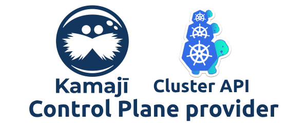

## Kamaji Cluster API Control Plane provider

  
  
  
  
  

The Kamaji Control Plane provider implementation of the [Cluster Management API](https://cluster-api.sigs.k8s.io/).

### 🤔 What is Kamaji?

[Kamaji](http://github.com/clastix/kamaji) is an Open-Source project offering hosted Kubernetes control planes.
tl;dr; the Control Plane is running in a management cluster as regular pods.

You can refer to the [official documentation website](https://kamaji.clastix.io/).

### 📄 Documentation

The Kamaji Cluster API Control Plane provider documentation is referenced in the [Kamaji documentation](https://kamaji.clastix.io/) website.

### 🚀 Supported CAPI infrastructure providers

| Infrastructure Provider                                                                                                                 | Version           |
|-----------------------------------------------------------------------------------------------------------------------------------------|-------------------|
| [AWS](https://github.com/kubernetes-sigs/cluster-api-provider-aws) ([technical considerations](docs/providers-aws.md))                  | += v2.4.0         |
| [Equinix/Packet](https://github.com/kubernetes-sigs/cluster-api-provider-packet) ([technical considerations](docs/providers-packet.md)) | += v0.7.2         |
| [Hetzner](https://github.com/syself/cluster-api-provider-hetzner)([technical considerations](docs/providers-hetzner.md))                | += v1.0.0-beta.30 |
| [KubeVirt](https://github.com/kubernetes-sigs/cluster-api-provider-kubevirt) ([technical considerations](docs/providers-kubevirt.md))   | += 0.1.7          |
| [Metal³](https://github.com/metal3-io/cluster-api-provider-metal3) ([technical considerations](docs/providers-metal3.md))               | += 1.4.0          |
| [Nutanix](https://github.com/nutanix-cloud-native/cluster-api-provider-nutanix) ([technical considerations](docs/providers-nutanix.md)) | += 1.2.4          |
| [OpenStack](https://github.com/kubernetes-sigs/cluster-api-provider-openstack)                                                          | += 0.8.0          |
| [Tinkerbell](https://github.com/tinkerbell/cluster-api-provider-tinkerbell) ([technical considerations](docs/providers-tinkerbell.md))  | += v0.5.2         |
| [vSphere](https://github.com/kubernetes-sigs/cluster-api-provider-vsphere) ([technical considerations](docs/providers-vsphere.md))      | += 1.7.0          |

> Are you looking for further integrations?
> Please, engage with the community on the [#kamaji](https://kubernetes.slack.com/archives/C03GLTTMWNN) Kubernetes Slack
> workspace channel, or using the **GitHub Discussion** section.

### 🛠 Development

This document describes how to use kind and [Tilt](https://tilt.dev/) for a simplified workflow that offers easy deployments and rapid iterative builds.
Before the next steps, make sure the initial setup for development environment steps is complete.

1. Create a `kind` cluster according to the [CAPI Infrastructure Provider requirements](https://cluster-api.sigs.k8s.io/user/quick-start#install-andor-configure-a-kubernetes-cluster) you're planning to use
2. [Install Cluster API](https://cluster-api.sigs.k8s.io/user/quick-start#initialize-the-management-cluster) with the `clusterctl` CLI
3. Install Kamaji (for the sake of simplicity, we suggest [Helm](https://github.com/clastix/kamaji/tree/master/charts/kamaji#install-kamaji))
4. Get the source of the Kamaji Control Plane provider and place in your desired `LOCATION`
5. Run the _Kamaji Cluster API Control Plane Provider_ as you prefer, as well as with `dlv` to debug it 
6. Run Tilt by issuing `tilt up`
7. You have a full development environment

### 🏷️ Versioning

Versioning adheres to the [Semantic Versioning](http://semver.org/) principles.
A full list of the available release is available in the GitHub repository's [**Release** section](https://github.com/clastix/cluster-api-control-plane-provider-kamaji/releases).

### 📄 Compatibility matrix

The Control Plane provider has several dependencies, such as Cluster API and Kamaji.

The following compatibility matrix is useful to match them according to the Control Plane provider version you're planning to run.

| CP provider | Cluster API    | Kamaji  | TCP API version |
|-------------|----------------|---------|-----------------|
| v0.8.0      | v1.5.x, v1.6.x | ~v0.5.x | `v1alpha1`      |
| v0.7.x      | v1.5.x, v1.6.x | ~v0.4.0 | `v1alpha1`      |
| v0.6.0      | v1.5.x, v1.6.x | ~v0.4.0 | `v1alpha1`      |
| v0.5.0      | v1.5.x         | ~v0.4.0 | `v1alpha1`      |
| v0.4.2      | v1.5.x         | ~v0.3.2 | `v1alpha1`      |
| v0.4.1      | v1.5.x         | ~v0.3.2 | `v1alpha1`      |
| v0.4.0      | v1.5.x         | ~v0.3.2 | `v1alpha1`      |
| v0.3.1      | v1.5.x         | ~v0.3.2 | `v1alpha1`      |
| v0.3.0      | v1.5.x         | ~v0.3.2 | `v1alpha1`      |
| v0.2.2      | v1.5.x         | ~v0.3.2 | `v1alpha1`      |
| v0.2.1      | v1.5.x         | v0.3.1  | `v1alpha1`      |
| v0.2.0      | v1.4.x         | v0.3.x  | `v1alpha1`      |
| v0.2.0      | v1.4.x         | v0.3.x  | `v1alpha1`      |
| v0.1.1      | v1.4.x         | v0.3.x  | `v1alpha1`      |
| v0.1.0      | v1.4.x         | v0.3.x  | `v1alpha1`      |

### 🤝 Contributions

Contributions are highly appreciated and very welcomed!

In case of bugs, please, check if the issue has been already opened by checking the [GitHub Issues](https://github.com/clastix/cluster-api-control-plane-provider-kamaji/issues) section.
In case it isn't, you can open a new one: a detailed report will help us to replicate it, assess it, and work on a fix.

You can express your intention in working on the fix on your own.
The commit messages are checked according to the described [semantics](https://github.com/projectcapsule/capsule/blob/main/CONTRIBUTING.md#semantics).
Commits are used to generate the changelog, and their author will be referenced in it.

### 📝 License

The Kamaji Cluster API Control Plane provider is licensed under Apache 2.0.
The code is provided as-is with no warranties.

### 🛟 Commercial Support

[CLASTIX](https://clastix.io/) is the commercial company behind Kamaji and the Cluster API Control Plane provider.

If you're looking to run Kamaji in production and would like to learn more, **CLASTIX** can help by offering [Open Source support plans](https://clastix.io/support),
as well as providing a comprehensive Enterprise Platform named [CLASTIX Enterprise Platform](https://clastix.cloud/), built on top of the Kamaji and [Capsule](https://capsule.clastix.io/) project (now donated to CNCF as a Sandbox project).

Feel free to get in touch with the provided [Contact form](https://clastix.io/contact).
